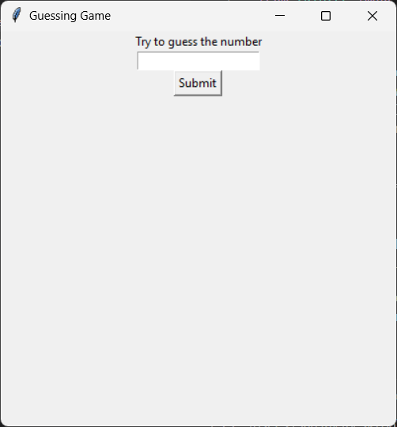

# Guess the number game 

## A GUI based guess the number game build in python

# Description:

Your local machine will select a number from 1 to 100 randomly and you have to guess the number.

# Installation:
```
git clone https://github.com/JestiferHarold/Fun-Games
cd /Fun-Games/"Guess the number"
python3 guess.py

```

# Screenshot:

